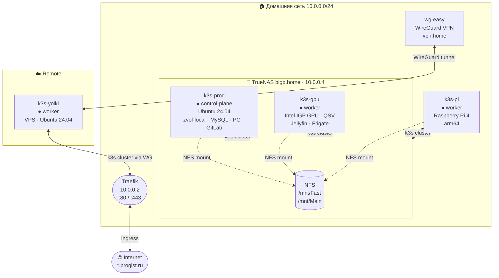
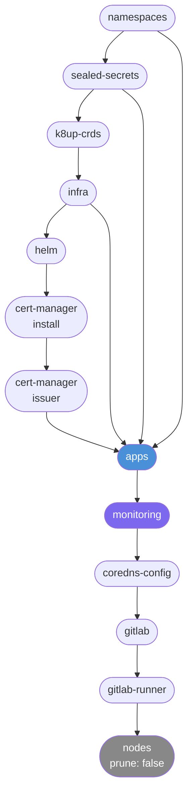
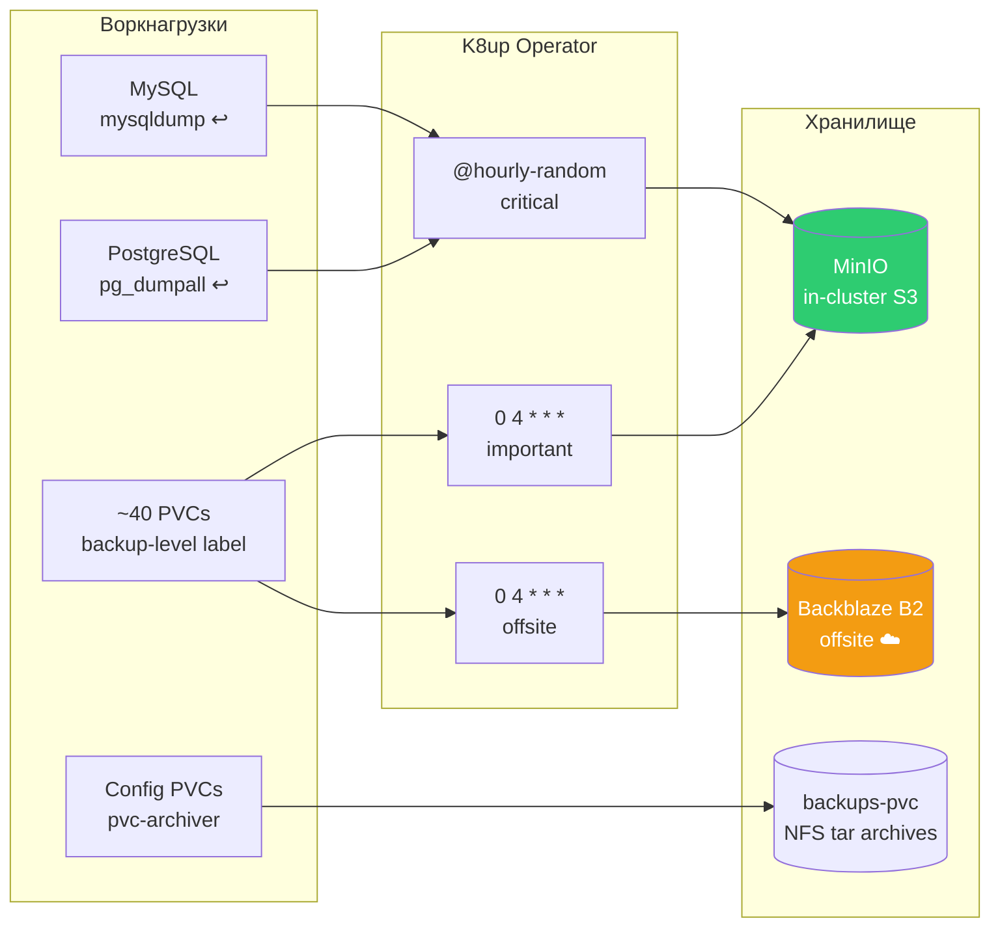
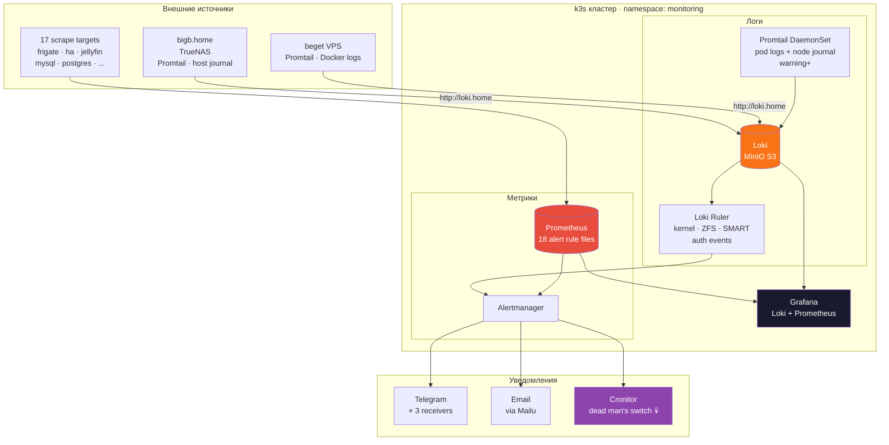

# Home GitOps Repository

Декларативные манифесты для домашнего кластера k3s.
Всё управляется через **Flux CD** — GitOps, zero-touch reconciliation.

---

## Кластер

| Узел | Роль | ОС | Особенности |
|------|------|----|-------------|
| k3s-prod | control-plane | Ubuntu 24.04 | zvol-local (БД, Prometheus, GitLab) |
| k3s-gpu | worker | Ubuntu 24.04 | Intel IGP GPU, QSV transcoding |
| k3s-yolki | worker | Ubuntu 24.04 | — |
| k3s-pi | worker | Ubuntu 24.04 | arm64 (Raspberry Pi) |

**Kubernetes:** v1.34 (k3s) | **Flux:** v2 (source-controller v1.8.1)
**Внешний домен:** `progist.ru` | **Внутренний:** `*.home`



---

## Структура репозитория

```
clusters/home/       — точка входа Flux, граф зависимостей Kustomization
apps/                — 42 приложения
infra/               — системные компоненты (Traefik, StorageClasses, MinIO, K8up, xray)
monitoring/          — kube-prometheus-stack, Loki, Promtail, правила алертов, exporters
helm/                — HelmRepository и HelmRelease манифесты
sealed-secrets/      — зашифрованные секреты: apps/, infra/, cluster/, gitlab/
namespaces/          — объявления Namespace
charts/              — локальные Helm charts (только: pvc-archiver)
cluster-addons/      — kube-system ресурсы под управлением Flux (CoreDNS DaemonSet)
cluster-config/      — cert-manager ClusterIssuers
gitlab/              — GitLab CE + runner
docs/recovery/       — шаблоны recovery pod для MySQL и Postgres
docs/                — truenas-exporters.md, k8up-restore.md
backup/              — бинари и конфиги TrueNAS exporters
```

---

## Зависимости Flux Kustomizations



---

## Секреты

Все секреты — **SealedSecrets** (kubeseal, RSA-4096), хранятся в Git:

- `sealed-secrets/apps/` — сервисные ключи, DB пароли, API токены
- `sealed-secrets/infra/` — системные конфиги (k8up, minio, xray)
- `sealed-secrets/cluster/` — Root CA, LetsEncrypt аккаунт
- `sealed-secrets/gitlab/` — GitLab + runner токены

**Ротация:**
```sh
# Расшифровать
kubeseal --cert cert.pem --recovery-unseal ...
# Перезапечатать
kubeseal --cert cert.pem <secret.yaml> -o yaml > sealed.yaml
# Commit → Flux reconciles
```

---

## TLS и Ingress

Ingress строго делится на два типа:

**Internal** (`*.home`) — самоподписанный Root CA:
```yaml
annotations:
  cert-manager.io/cluster-issuer: root-ca-issuer
  traefik.ingress.kubernetes.io/router.middlewares: infra-redirect-to-https@kubernetescrd
spec:
  tls:
    - hosts: [app.home]
      secretName: app-internal-tls
```

**External** (`*.progist.ru`) — Let's Encrypt:
```yaml
annotations:
  cert-manager.io/cluster-issuer: letsencrypt-prod
  traefik.ingress.kubernetes.io/router.middlewares: infra-redirect-to-https@kubernetescrd
spec:
  tls:
    - hosts: [app.progist.ru]
      secretName: app-external-tls
```

---

## StorageClasses

Все PV на NFS (TrueNAS `10.0.0.4`), mount options: `nfsvers=4.1,hard,rsize=65536,wsize=65536`.

| StorageClass | Назначение | Reclaim |
|---|---|---|
| `nfs-nvme-manual` / `nfs-nvme-db-manual` | БД, критичные конфиги | Retain |
| `nfs-fast-manual` | Данные приложений | Retain |
| `nfs-hdd-manual` / `nfs-hdd-manual-media` | Медиа, большие файлы | Retain |
| `mailu` | Почтовый сервер | Retain |
| `nfs-dynamic` | Кэш, ephemeral | Delete |
| `hostpath-manual` | GPU/hardware temp | Retain |
| `zvol-local` | Локальный ZFS (только k3s-prod) | Retain |

Критичные данные — `manual` (Retain). Кэш — `dynamic` (Delete).

---

## Бэкапы

### K8up (restic → MinIO / Backblaze B2)

| Schedule | Частота | Бэкенд | Selector |
|----------|---------|--------|---------|
| `backup-critical-hourly` | `@hourly-random` | MinIO | `backup-level: critical` |
| `backup-important-daily` | `0 4 * * *` | MinIO | `backup-level: important\|daily` |
| `backup-important-daily-offsite` | `0 4 * * *` | Backblaze B2 | все + `backup-offsite: "true"` |
| `backup-monitoring-daily` | `0 4 * * *` | MinIO | namespace monitoring |

Retention: keepLast=12, keepDaily=7, keepWeekly=4, keepMonthly=1.



Пометить PVC для бэкапа:
```yaml
labels:
  backup-level: critical   # или: important, daily
  backup-offsite: "true"
annotations:
  k8up.io/backup: "true"
```

### SQL дампы

MySQL и Postgres имеют аннотацию `k8up.io/backupcommand` — K8up запускает дамп перед snapshot'ом.
Дополнительно отдельные CronJob (`backup-immich-postgres`, `backup-mysql`, `backup-postgres`) сохраняют дампы на `backups-pvc`.

### pvc-archiver

Локальный Helm chart (`charts/pvc-archiver/`) — tar-архивирует содержимое PVC в `backups-pvc`.
Развёртывается как HelmRelease в `helm/` для каждого приложения (~37 штук).

---

## Мониторинг



- **kube-prometheus-stack** — Prometheus, Alertmanager, Grafana; 18 файлов alert rules
- **Loki + Promtail** — централизованные логи, backend на MinIO S3; DaemonSet собирает логи подов и host journal (warning+) со всех нод
- **Loki ingress** (`loki.home`) — внешние Promtail-агенты пишут через HTTP; работают на bigb.home (TrueNAS, full journal warning+) и beget VPS (Docker container logs)
- **Loki alert rules** — kernel soft lockup, OOM, hung task, ZFS errors, SMART errors, auth events (Immich, Authentik, Jellyfin)
- **Dead man's switch** — Alertmanager Watchdog → Cronitor heartbeat (алерт если Prometheus/AM падает)
- **Alertmanager** — 3 Telegram-ресивера + Email через Mailu
- **Exporters** — mysql, postgres, redis, adguard, snmp, ssl
- **17 внешних scrape targets** — frigate, home-assistant, jellyfin, postgres, mysql, redis, authentik, traefik, blocky, adguard, bonchbot, k8up, ssl, snmp, gitlab, external-nodes

---

## Автоматические обновления (Renovate)

- Patch/minor — automerge
- Major — ручное согласование (assigned to `progist`)
- Managers: `kubernetes`, `helm-values`, `flux`, `kustomize`
- Исключения: `sealed-secrets/**`
- Лимиты: 50 параллельных бранчей, 10 PR

Специальные правила версий:
- **Transmission:** `<2000` (legacy versioning)
- **Home Assistant:** custom regex `year.month.patch`
- **Immich:** major — только вручную

---

## Disaster Recovery

### Bootstrap кластера

```sh
flux bootstrap git \
  --url=git@your-repo \
  --branch=main \
  --path=clusters/home
```

### Чеклист после bootstrap

1. CoreDNS: `kubectl get ds coredns -n kube-system` — 1 pod на узел
2. DNS: `kubectl run -it --rm dns-test --image=busybox --restart=Never -- nslookup kubernetes.default.svc.cluster.local`
3. Ingress — Traefik running, cert-manager issuers ready
4. PV/PVC — NFS mounts доступны (NFS: 10.0.0.4)
5. SealedSecrets — контроллер работает, секреты расшифровываются
6. Flux: `flux get kustomizations` — все Ready
7. GPU: `kubectl get nodes -o custom-columns=NAME:.metadata.name,GPU:.status.allocatable.gpu\\.intel\\.com/i915`

### Recovery pods

```sh
kubectl apply -f docs/recovery/mysql-recovery-pod.yaml    # mysql-data-pvc, user 999
kubectl apply -f docs/recovery/postgres-recovery-pod.yaml # postgres-data-pvc, user 999
# exec in, inspect/repair, then:
kubectl delete -f docs/recovery/<file>.yaml
```

Восстановление из K8up бэкапов — [`docs/k8up-restore.md`](docs/k8up-restore.md).

### TrueNAS exporters

После переустановки TrueNAS — см. [`docs/truenas-exporters.md`](docs/truenas-exporters.md).
Бинари: `backup/truenas-exporters/`.
Важно: patched `smartmon.sh` (NVMe support), MD5: `f84f7d773f4c0912ef20f97497b86d97`.

---

## CoreDNS (важная деталь)

CoreDNS управляется как **DaemonSet** через Flux (`cluster-addons/`), а не k3s Deployment.

`/etc/rancher/k3s/config.yaml` на **k3s-prod** обязательно должен содержать:
```yaml
disable:
  - coredns
kubelet-arg:
  - "max-pods=250"
```

Без `disable: [coredns]` — k3s пересоздаёт свой CoreDNS Deployment при рестарте, конфликт с DaemonSet, временный DNS outage.

---

## Non-K8s сервисы

Сервисы вне кластера проксируются через headless Service + Endpoints + Traefik ingress.

```yaml
apiVersion: v1
kind: Service
metadata:
  name: my-proxy
  namespace: apps
spec:
  clusterIP: None
  ports:
    - port: 80
      targetPort: 8080
---
apiVersion: v1
kind: Endpoints
metadata:
  name: my-proxy
  namespace: apps
subsets:
  - addresses:
      - ip: 10.0.0.X
    ports:
      - port: 8080
```

Примеры: роутер (10.0.0.1), принтер, WLED контроллеры.

---

## GPU workloads

```yaml
nodeSelector:
  node.hardware.gpu: intel-igpu
tolerations:
  - key: node.hardware.gpu
    value: intel-igpu
    effect: NoSchedule
```

Применяется к: jellyfin, frigate.
